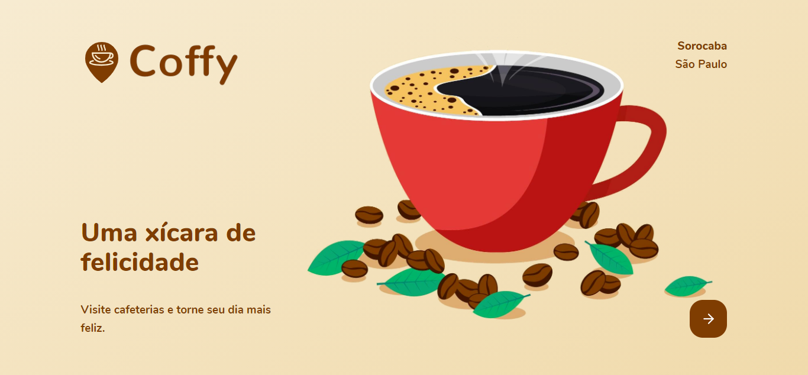

<!-- 

 -->

# Coffy - Next Level Week #3

## Descrição

Projeto desenvolvido durante o evento Next Level Week 3, promovido pela [Rocketseat](https://rocketseat.com.br/).

## Sobre o app _Coffy_

O app **Coffy** é o app dos amantes de um bom café! A inspiração surgiu quando me vi anotando em um caderninho todas as minhas experiências visitando cafeterias ao redor da cidade de Sorocaba. As fotos deixava sempre guardadas no celular. Decidi então aproveitar a NLW#3 para tirar do papel minha ideia de "Passaporte Coffee Lover", e daí surgiu o Coffy! Ainda faltam vários ajustes, mas agora que o projeto finalmente está iniciado, me dedicarei ao máximo para melhorá-lo cada vez mais!

Nesse Dia das Crianças, meu presente vai para os amantes de café!

<!-- ## Backend

- Typescript
- ts-node-dev
- Express
- TypeORM
- SQLite 3
- Multer
- Yup

## Frontend

- Mapbox

## Mobile

- Expo
- react-native-maps
- React Navigator -->
